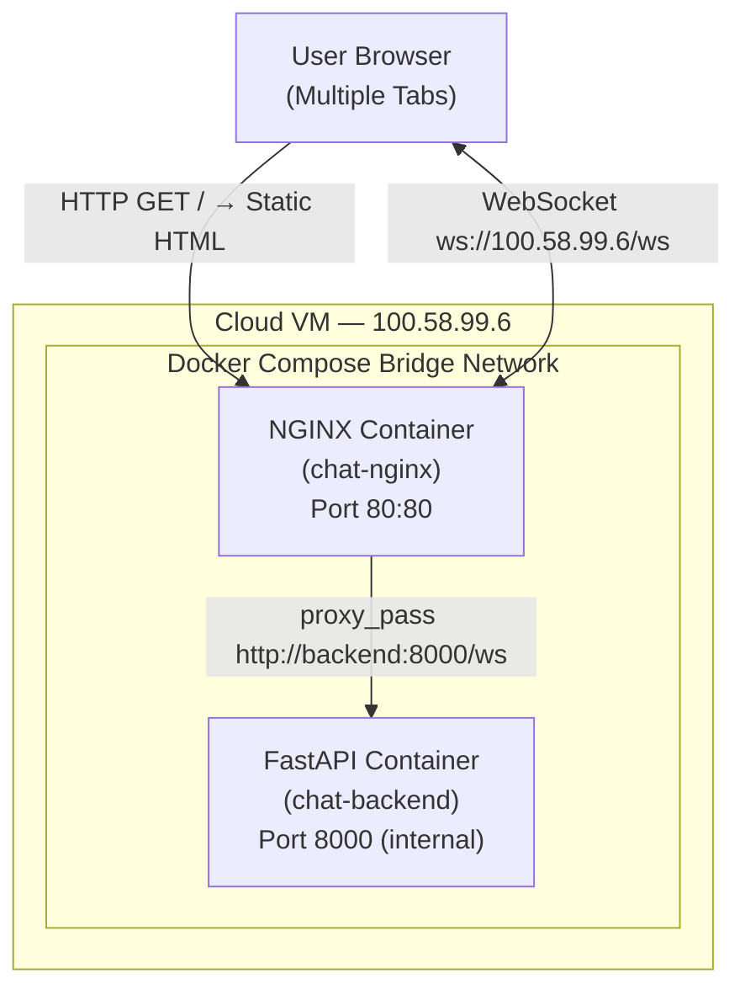
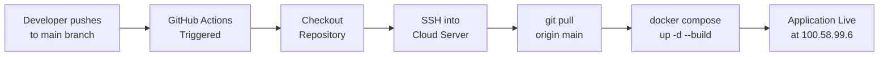
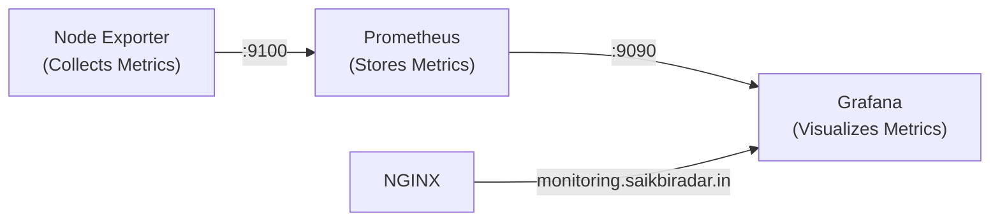
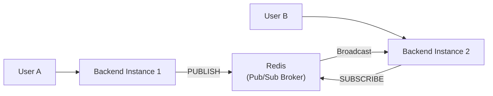

# Real-Time WebSocket Chat Application — Docker + Nginx + CI/CD

## 1. Project Overview

This project is a **real-time multi-user chat application** built with FastAPI (Python) and WebSockets, deployed in a production-style containerized environment. The system uses **Docker** and **Docker Compose** to orchestrate two services — a Python backend and an NGINX reverse proxy — and is automatically deployed to a live cloud server via a **GitHub Actions CI/CD pipeline**.

The original staging environment was deliberately misconfigured. As part of this DevOps assignment, three critical infrastructure bugs were identified, debugged, and resolved to bring the application to a fully operational state.

### Directory Structure

```text
devops-Spotsure/
├── app/
│   ├── main.py                  # FastAPI WebSocket application server
│   └── requirements.txt         # Python dependencies (fastapi, uvicorn, websockets)
├── frontend/
│   └── index.html               # Single-page HTML/CSS/JS chat client
├── .github/
│   └── workflows/
│       └── deploy.yaml          # GitHub Actions CI/CD pipeline
├── Dockerfile                   # Builds the Python backend image
├── docker-compose.yml           # Orchestrates backend + nginx services
├── nginx.conf                   # NGINX reverse proxy configuration
└── README.md                    # This documentation
```

---

## 2. Architecture Diagram



**Traffic Flow:**
1. A user opens `http://100.58.99.6` in their browser.
2. NGINX intercepts the request and serves `index.html` from the mounted `frontend/` directory.
3. The browser's JavaScript opens a WebSocket connection to `ws://100.58.99.6/ws`.
4. NGINX upgrades the HTTP connection to WebSocket and proxies it to the FastAPI backend at `http://backend:8000/ws` over the internal Docker network.
5. The FastAPI server manages bi-directional real-time messaging between all connected clients.

---

## 3. How Docker Containers Are Set Up

The application runs as two Docker containers orchestrated by `docker-compose.yml`:

### Backend Container (`chat-backend`)
- **Image**: Built from a custom `Dockerfile` using `python:3.11-slim` as the base.
- **Build Process**:
  1. Sets `/app` as the working directory.
  2. Copies `app/requirements.txt` and installs dependencies (`fastapi`, `uvicorn`, `websockets`) via `pip`.
  3. Copies `app/main.py` into the container.
  4. Exposes port `8000` (internal only — not published to the host).
  5. Starts the Uvicorn ASGI server bound to `0.0.0.0:8000`.
- **Restart Policy**: `restart: always` — the container automatically restarts on crashes or server reboots.

### NGINX Container (`chat-nginx`)
- **Image**: Official `nginx:alpine` (lightweight Alpine-based image).
- **Port Mapping**: Host port `80` → Container port `80`. This is the only publicly accessible port.
- **Volume Mounts** (read-only):
  - `./frontend:/usr/share/nginx/html:ro` — Serves the static frontend files.
  - `./nginx.conf:/etc/nginx/nginx.conf:ro` — Custom NGINX configuration for reverse proxying.
- **Dependency**: `depends_on: backend` — ensures the backend starts before NGINX.
- **Restart Policy**: `restart: always`.

---

## 4. How Docker Networking Works

When `docker-compose up` is executed, Docker Compose automatically creates an isolated **bridge network** (named `devops-spotsure_default`).

### Key Networking Concepts Used:

| Concept | How It Works |
| :--- | :--- |
| **Bridge Network** | Both `chat-backend` and `chat-nginx` containers are attached to the same virtual bridge network, enabling direct communication between them. |
| **DNS-Based Service Discovery** | Docker Compose embeds a DNS server inside the network. Containers resolve each other by their **service name** (e.g., `backend`), not by IP address. This is why `proxy_pass http://backend:8000/ws` works in `nginx.conf`. |
| **Port Isolation** | The backend's port `8000` is only `expose`d (internal to Docker network), not `publish`ed to the host. Only NGINX's port `80` is mapped to the host, ensuring the backend is never directly accessible from the internet. |
| **Container-to-Container Communication** | NGINX communicates with the FastAPI backend using the internal Docker DNS hostname `backend` on port `8000`. No static IPs are needed. |

---

## 5. How Nginx Reverse Proxy Works

NGINX acts as the **single public-facing entry point** on port 80 and performs two roles:

### Role 1: Static File Server
```nginx
location / {
    root /usr/share/nginx/html;
    index index.html;
    try_files $uri $uri/ /index.html;
}
```
- When a browser requests `http://100.58.99.6/`, NGINX serves `index.html` directly from the mounted `frontend/` directory.
- The `try_files` directive ensures that any path falls back to `index.html` (useful for single-page applications).

### Role 2: Reverse Proxy for WebSocket
```nginx
location /ws {
    proxy_pass http://backend:8000/ws;
    proxy_http_version 1.1;
    proxy_set_header Upgrade $http_upgrade;
    proxy_set_header Connection "upgrade";
    ...
}
```
- Any request to `/ws` is forwarded to the backend container at `http://backend:8000/ws`.
- NGINX uses Docker's internal DNS to resolve `backend` to the FastAPI container's IP.
- Additional headers (`X-Real-IP`, `X-Forwarded-For`, `X-Forwarded-Proto`) preserve the original client information through the proxy.

---

## 6. How WebSocket Works Through Nginx

WebSocket is a protocol that enables **persistent, full-duplex communication** between the browser and server over a single TCP connection. Unlike standard HTTP (request → response → close), a WebSocket connection stays open, allowing instant real-time message exchange.

### The WebSocket Handshake Through NGINX:

1. **Client initiates**: The browser sends an HTTP request to `ws://100.58.99.6/ws` with special headers:
   ```
   GET /ws HTTP/1.1
   Upgrade: websocket
   Connection: Upgrade
   ```

2. **NGINX forwards the upgrade**: The critical NGINX configuration that makes this work:
   ```nginx
   proxy_http_version 1.1;                        # Required — WebSocket needs HTTP/1.1
   proxy_set_header Upgrade $http_upgrade;         # Passes the "Upgrade: websocket" header
   proxy_set_header Connection "upgrade";          # Passes the "Connection: Upgrade" header
   ```

3. **Backend accepts**: FastAPI's WebSocket endpoint at `/ws` accepts the connection and responds with `HTTP 101 Switching Protocols`.

4. **Persistent tunnel established**: The TCP connection between browser → NGINX → backend remains open. Messages flow bi-directionally in real time.

5. **Timeout configuration**: To prevent NGINX from closing long-lived WebSocket connections:
   ```nginx
   proxy_read_timeout 86400s;    # Keep connection alive for up to 24 hours
   proxy_send_timeout 86400s;
   ```

---

## 7. How CI/CD Pipeline Works

The project uses **GitHub Actions** for automated deployment. The workflow file is located at `.github/workflows/deploy.yaml`.

### Pipeline Trigger
```yaml
on:
  push:
    branches: ["main"]
```
The pipeline runs automatically on every `git push` to the `main` branch.

### Pipeline Steps

| Step | Action | Description |
| :--- | :--- | :--- |
| 1 | **Checkout Code** | Uses `actions/checkout@v4` to clone the repository on the GitHub runner. |
| 2 | **SSH into Cloud Server** | Uses `appleboy/ssh-action@v1` to establish a secure SSH connection to the cloud VM using GitHub Secrets. |
| 3 | **Pull Latest Code** | Runs `git pull origin main` on the server to fetch the newest changes. |
| 4 | **Rebuild & Restart Containers** | Runs `docker compose up -d --build` to rebuild images with latest code and restart services with zero manual intervention. |

### Required GitHub Secrets

| Secret Name | Value |
| :--- | :--- |
| `SERVER_HOST` | Public IP of the cloud VM |
| `SERVER_USERNAME` | SSH username (e.g., `ubuntu`) |
| `SSH_PRIVATE_KEY` | Private SSH key for server authentication |

### Deployment Flow Diagram



---

## 8. Issues Found and How They Were Fixed

The repository was deliberately misconfigured with three bugs. Here is a detailed breakdown:

### Bug 1: Backend Binding to Loopback Address

| | Details |
| :--- | :--- |
| **File** | `Dockerfile` (line 13) |
| **Original** | `CMD ["uvicorn", "main:app", "--host", "127.0.0.1", "--port", "8000"]` |
| **Problem** | `127.0.0.1` is the loopback address. Inside a Docker container, this means the server only accepts connections from within the same container. The NGINX container (on a different network interface) could not reach the backend at all. |
| **Fix** | Changed to `--host 0.0.0.0` — this binds the server to **all network interfaces**, making it accessible to other containers on the Docker bridge network. |
| **Fixed Line** | `CMD ["uvicorn", "main:app", "--host", "0.0.0.0", "--port", "8000"]` |

### Bug 2: Frontend Volume Mount Commented Out

| | Details |
| :--- | :--- |
| **File** | `docker-compose.yml` (line 18) |
| **Original** | `# - ./frontend:/usr/share/nginx/html:ro` (commented out) |
| **Problem** | Without this volume mount, NGINX had no access to the `frontend/` directory. It served the default "Welcome to nginx!" page instead of the chat application. |
| **Fix** | Uncommented the volume mount line so NGINX can serve the static HTML files from the host's `frontend/` directory. |
| **Fixed Line** | `- ./frontend:/usr/share/nginx/html:ro` |

### Bug 3: Broken WebSocket Proxy Configuration

| | Details |
| :--- | :--- |
| **File** | `nginx.conf` (lines 20–23) |
| **Original** | `proxy_pass http://localhost:8000/ws;` + commented-out Upgrade headers |
| **Problem 1** | `localhost` inside the NGINX container refers to the NGINX container itself, not the backend. Containers are isolated and have their own network namespaces. |
| **Problem 2** | The `Upgrade` and `Connection` headers were commented out. Without these, NGINX cannot perform the HTTP → WebSocket protocol upgrade, causing all WebSocket connections to fail immediately. |
| **Fix** | Changed `localhost` to `backend` (Docker Compose service name resolved via internal DNS) and uncommented both WebSocket upgrade headers. |
| **Fixed Lines** | `proxy_pass http://backend:8000/ws;` + `proxy_set_header Upgrade $http_upgrade;` + `proxy_set_header Connection "upgrade";` |

---

## 9. Steps to Deploy the Project

### Prerequisites
- Docker and Docker Compose installed
- Git installed

### Local Deployment
```bash
# 1. Clone the repository
git clone https://github.com/Saikiran121/devops-Spotsure.git
cd devops-Spotsure

# 2. Build and start containers
docker-compose up -d --build

# 3. Verify containers are running
docker-compose ps

# 4. Open the application
# Navigate to http://localhost in your browser
# Open multiple tabs to test real-time chat
```

### Cloud Server Deployment
```bash
# 1. Provision a Linux VM (Ubuntu 22.04) on AWS/GCP/Oracle Cloud
# 2. Open ports 22 (SSH) and 80 (HTTP) in security groups/firewall

# 3. SSH into the server and install Docker
sudo apt update && sudo apt install -y docker.io docker-compose-v2 git
sudo usermod -aG docker $USER

# 4. Clone and start
git clone https://github.com/Saikiran121/devops-Spotsure.git ~/devops-Spotsure
cd ~/devops-Spotsure
docker compose up -d --build

# 5. Access the application at http://<your-public-ip>
```

### CI/CD Automated Deployment
1. Go to your GitHub repo → **Settings** → **Secrets and variables** → **Actions**.
2. Add the following repository secrets:
   - `SERVER_HOST` — Your cloud VM's public IP address
   - `SERVER_USERNAME` — SSH username (e.g., `ubuntu`)
   - `SSH_PRIVATE_KEY` — Your private SSH key content
3. Push any change to the `main` branch — deployment runs automatically.

---

## 10. Bonus: HTTPS with Let's Encrypt

As a bonus, the application has been secured with **HTTPS** using a free SSL certificate from **Let's Encrypt**, served through a custom domain.

### How It Works

A third container — **Certbot** (`certbot/certbot`) — was added to `docker-compose.yml`. Certbot is responsible for generating and renewing SSL/TLS certificates from Let's Encrypt. It shares two volumes with the NGINX container:

| Volume | Purpose |
| :--- | :--- |
| `./certbot/conf:/etc/letsencrypt` | Stores the generated SSL certificates (`fullchain.pem`, `privkey.pem`) |
| `./certbot/www:/var/www/certbot` | Used by Certbot's ACME challenge to verify domain ownership |

### SSL Certificate Generation Steps

1. **DNS Configuration**: Added A records on Hostinger pointing `saikbiradar.in` and `www.saikbiradar.in` to the cloud VM's public IP.

2. **CAA Record Fix**: Removed the existing CAA DNS record that was blocking Let's Encrypt from issuing certificates for the domain.

3. **Temporary HTTP Config**: Started NGINX with an HTTP-only `nginx.conf` (port 80) that includes the ACME challenge directory:
   ```nginx
   location /.well-known/acme-challenge/ {
       root /var/www/certbot;
   }
   ```

4. **Certificate Generation**: Ran Certbot inside Docker to generate the SSL certificate:
   ```bash
   docker compose run --rm certbot certonly \
     --webroot \
     --webroot-path=/var/www/certbot \
     --email saikiranbiradar0309@gmail.com \
     --agree-tos \
     --no-eff-email \
     -d saikbiradar.in \
     -d www.saikbiradar.in
   ```

5. **HTTPS NGINX Config**: Switched `nginx.conf` to the full HTTPS version with two server blocks:
   - **Port 80 server**: Redirects all HTTP traffic to HTTPS with `return 301 https://$host$request_uri`
   - **Port 443 server**: Serves the application over HTTPS using the generated certificates:
     ```nginx
     listen 443 ssl;
     ssl_certificate /etc/letsencrypt/live/saikbiradar.in/fullchain.pem;
     ssl_certificate_key /etc/letsencrypt/live/saikbiradar.in/privkey.pem;
     ```

6. **Restarted NGINX**: `docker compose restart nginx` — NGINX now serves the app securely with a padlock icon.

### Certificate Auto-Renewal

Let's Encrypt certificates expire every **90 days**. A cron job was configured on the server to automatically renew:
```bash
# Runs daily at 3 AM — checks if renewal is needed
0 3 * * * cd ~/devops-Spotsure && docker compose run --rm certbot renew && docker compose restart nginx
```

---

## 11. Bonus: Monitoring with Grafana + Prometheus

As an additional bonus, a full **monitoring stack** has been deployed to track real-time server metrics (CPU, RAM, Disk, Network).

### Monitoring Architecture



### Stack Components

| Container | Image | Role |
| :--- | :--- | :--- |
| `node-exporter` | `prom/node-exporter` | Collects host system metrics (CPU, RAM, Disk, Network) from `/proc` and `/sys` |
| `prometheus` | `prom/prometheus` | Scrapes Node Exporter every 15 seconds and stores time-series data |
| `grafana` | `grafana/grafana` | Web-based dashboard that queries Prometheus and renders beautiful charts |

### Prometheus Configuration (`prometheus.yml`)

```yaml
global:
  scrape_interval: 15s

scrape_configs:
  - job_name: 'node'
    static_configs:
      - targets: ['node-exporter:9100']
```

Prometheus uses Docker's internal DNS to resolve `node-exporter` and scrape metrics from port `9100` every 15 seconds.

### NGINX Routing

NGINX reverse proxies `monitoring.saikbiradar.in` to the Grafana container on port `3000`:

```nginx
server {
    listen 443 ssl;
    server_name monitoring.saikbiradar.in;

    ssl_certificate /etc/letsencrypt/live/monitoring.saikbiradar.in/fullchain.pem;
    ssl_certificate_key /etc/letsencrypt/live/monitoring.saikbiradar.in/privkey.pem;

    location / {
        proxy_pass http://grafana:3000;
    }
}
```

### How to Set Up the Grafana Dashboard

1. **Access Grafana**: Navigate to [https://monitoring.saikbiradar.in](https://monitoring.saikbiradar.in).
2. **Login**: Default credentials are `admin` / `Saikiran`.
3. **Add Data Source**:
   - Go to **Connections** → **Data Sources** → **Add data source**.
   - Select **Prometheus**.
   - Set the Prometheus server URL to: `http://prometheus:9090`
     *(This is an internal Docker DNS name, not a public URL).*
   - Click **Save & test** — you should see a green checkmark.
4. **Import Dashboard**:
   - Go to **Dashboards** → **Import**.
   - Enter Dashboard ID: **`1860`** (Node Exporter Full) and click **Load**.
   - Select the **Prometheus** data source from the dropdown.
   - Click **Import**.
5. **View Metrics**: The dashboard will display real-time CPU usage, RAM consumption, Disk I/O, Network traffic, and more.

---

## 12. Bonus: Redis Infrastructure

A production-ready **Redis** container has been provisioned as part of the infrastructure to enable future horizontal scaling of the WebSocket application.

### Why Redis?

In a single-server setup, all WebSocket connections live in the same process memory, so broadcasting messages works out of the box. However, when scaling horizontally behind a **Load Balancer** with multiple backend instances, users connected to different servers cannot communicate with each other.

Redis solves this by acting as a **central message broker** using its Pub/Sub feature:



When Backend Instance 1 receives a message from User A, it **publishes** it to a Redis channel. Backend Instance 2 is **subscribed** to the same channel and receives the message, then broadcasts it to User B. This ensures real-time communication works across all server instances.

### Docker Compose Configuration

```yaml
redis:
  image: redis:alpine
  container_name: chat-redis
  restart: always
  expose:
    - "6379"
  volumes:
    - redis_data:/data
  healthcheck:
    test: ["CMD", "redis-cli", "ping"]
    interval: 10s
    timeout: 5s
    retries: 3
```

### Key Design Decisions

| Decision | Rationale |
| :--- | :--- |
| `redis:alpine` | Minimal image size (~30MB) for faster deployments |
| `expose` instead of `ports` | Redis is only accessible within the Docker network — **not exposed to the public internet** for security |
| `volumes: redis_data:/data` | Persistent storage ensures cached data survives container restarts |
| `healthcheck` | The `backend` service uses `depends_on: condition: service_healthy` to ensure Redis is fully ready before the application starts |

### Connectivity

Redis is accessible to all containers on the Docker network at:
```
redis:6379
```
This uses Docker's internal DNS resolution — no public ports or firewall rules required.

---

## 13. Bonus: AWS Architecture (Load Balancing & Auto Scaling)

To ensure high availability, fault tolerance, and the ability to handle traffic spikes, the application is designed to be deployed using AWS Auto Scaling and an Application Load Balancer (ALB).

### Load Balancer Architecture

The **AWS Application Load Balancer (ALB)** sits in front of the EC2 instances and acts as the single point of entry for all internet traffic.

```mermaid
graph TD
    UserBrowser["User Browser"] -->|HTTPS (443)| ALB["AWS ALB<br/>(Terminates SSL via ACM)"]
    ALB -->|HTTP (80)| Instance1["EC2 Instance 1<br/>(NGINX + FastAPI)"]
    ALB -->|HTTP (80)| Instance2["EC2 Instance 2<br/>(NGINX + FastAPI)"]
    Instance1 --> Redis["Redis Cache<br/>(Pub/Sub)"]
    Instance2 --> Redis
```

#### Key Load Balancer Configurations:
1. **AWS Certificate Manager (ACM)**: Instead of manually managing Let's Encrypt certificates on individual servers, the ALB terminates SSL connections using a free, auto-renewing certificate provisioned by AWS ACM. This offloads cryptographic workloads from the EC2 instances.
2. **Sticky Sessions (Session Affinity)**: Because the application uses persistent **WebSockets**, the ALB Target Group must be configured with Sticky Sessions. This ensures that once a user establishes a WebSocket handshake with a specific EC2 instance, all subsequent packets for that session are routed to the same instance.
3. **Health Checks**: The ALB pings the EC2 instances every 30 seconds. If an instance becomes unresponsive, the ALB stops routing traffic to it until it recovers.

### Auto Scaling Approach

An **Auto Scaling Group (ASG)** automatically adjusts the number of running EC2 instances based on real-time application load.

#### Scaling Implementation:
1. **Launch Template**: A custom Amazon Machine Image (AMI) is created containing Docker, Docker Compose, and a User Data script. When the ASG launches a new instance, the User Data script automatically runs `git pull` and `docker compose up -d` to bootstrap the application without human intervention.
2. **Capacity Rules**:
   - **Minimum**: 1 instance (always running).
   - **Desired**: 2 instances (normal operation).
   - **Maximum**: 4 instances (peak traffic limit).
3. **Scaling Policy**: A **Target Tracking Scaling Policy** is used. If average CPU utilization across the instances exceeds **70%**, the ASG launches a new EC2 instance and registers it with the ALB. When traffic subsides and CPU falls below the threshold, the ASG gracefully terminates the extra instances to optimize cloud costs.

---

## 14. Live Deployment

| | |
| :--- | :--- |
| **Chat App (HTTPS)** | [https://saikbiradar.in](https://saikbiradar.in) |
| **Monitoring (HTTPS)** | [https://monitoring.saikbiradar.in](https://monitoring.saikbiradar.in) |
| **Public IP** | `34.207.68.52` |
| **Status** | 🔒 Secured & Operational |
| **SSL Certificates** | Let's Encrypt (valid until Oct 27, 2026) |
| **Multi-User Chat** | Open multiple browser tabs to test real-time WebSocket messaging |